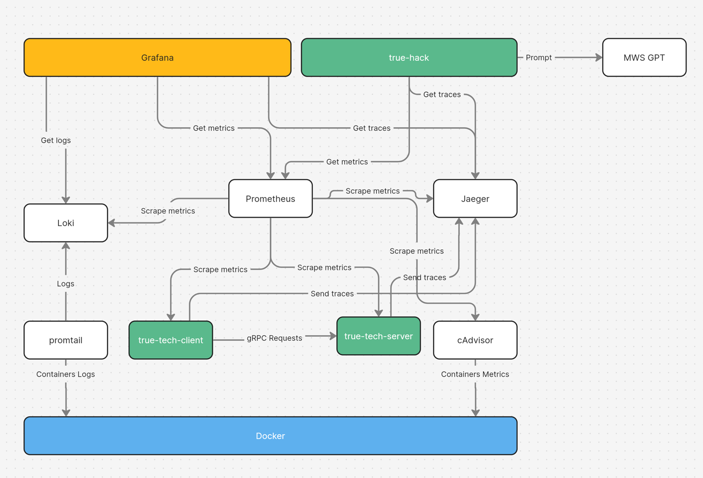

# true-hack-inside

Содержит готовую инфраструктуру для Observability, собранному в одном docker-compose файле и состоит из следующих
компонентов:

- grafana - собстенно, сама система для визуализации данных по логам/трейсам/метрикам
- prometheus - система агрегации метрик
- loki - система агрегации логов
- promtail - собирает логи с контейнеров и кладет в loki
- jaeger - система агрегации трейсов
- cadvisor - сбор контейнерных метрик
- true-tech-server - тестовый gRPC сервер
- true-tech-client - тестовый gRPC клиент, который шлет рандомные запросы на сервер и генерирует нагрузку

## Запуск

Для запуска всей шайтан-машины достаточно вызвать `docker-compose up -d`.

Графана доступна по адресу `http://localhost:3000`.

Для пересборки true-tech-client, true-tech-server - `docker-compose build`.

Остановить все - `docker-compose down`.

Для `true-tech-server` есть возможность эмулировать различные отказы:

`curl http://localhost:9081/debug/control?panic=true&error=true&delay=true`
* panic=true - любые gRPC запросы к сереверу будут приводить к панике
* error=true - любые gRPC запросы к сереверу будут возвращат ошибку Internal (Code=14)
* delay=true - любые gRPC запросы к серверу будут обрабатываться с задержкой от 100мс до 1000мс

***Note: для сборки true-tech-client, true-tech-server нужен установленный Go (да простят меня питонисты).
Я не успел никуда запушить готовые образы, поэтому при первом запуске docker-compose будет сборка тестовых микросервисов.***

***Note 2: не успел проговырять Grafana Provisioning, поэтому закоммитил полный дамп графаны (простите 2).***

## Схема (упрощенно)

